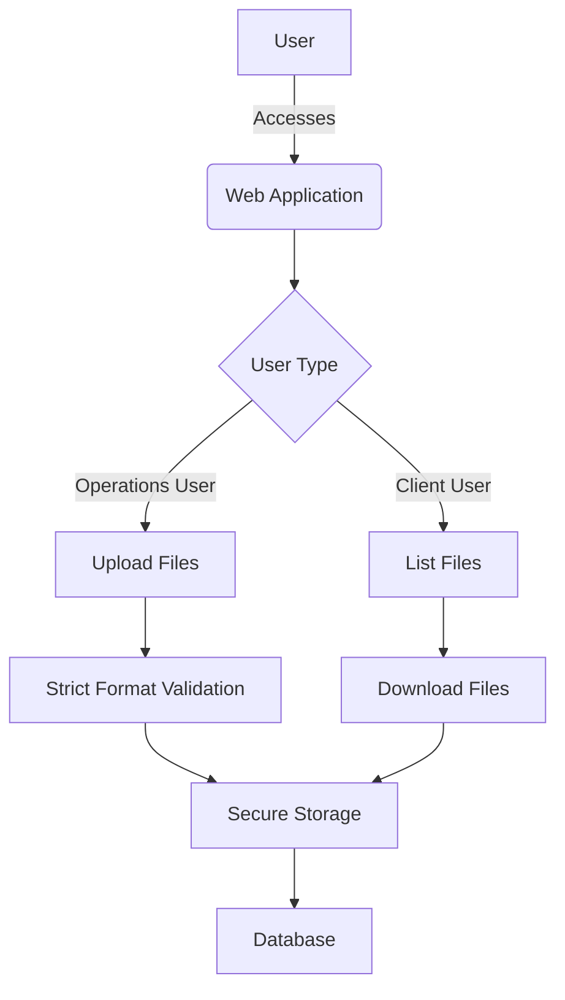

# ASSIGNMENT EZ-Labs (Backend) - Secure File Management System

<div align="center">
  <br />
  
  <br /><br />
  
  <div>
    
    
    
    
    
  </div>
  
  <h2>Secure Document Management for Operations and Client Users</h2>
  <p>A robust file management system with role-based access control and secure document handling</p>
</div>

## 🚀 Overview

The Secure File Management System is a Flask-based application that provides a secure platform for operations teams and clients to manage office documents. With strict file format validation (PPTX, DOCX, XLSX), encrypted email verification, and role-based access control, this solution ensures secure document handling while maintaining an intuitive user experience.



## ✨ Key Features

### 🔒 Role-Based Access Control
- **Operations Users**: Upload office documents (PPTX/DOCX/XLSX)
- **Client Users**: List and download available files
- **Secure Sessions**: Protected with encrypted tokens

### 📁 File Management
- **Strict Validation**: Only approved file formats accepted
- **Visual Indicators**: File type icons for quick identification
- **Size Display**: Human-readable file sizes (KB/MB/GB)

### ✉️ Secure Authentication
- **Encrypted Verification**: Time-limited email verification links
- **Session Protection**: Secure session management
- **Form Validation**: Client and server-side input validation

### 🎨 User Experience
- **Responsive Design**: Works on all device sizes
- **Intuitive Navigation**: Clear user pathways
- **Visual Feedback**: Action confirmation and error messages

## 🛠️ Tech Stack

| Category        | Technologies                                                                 |
|-----------------|------------------------------------------------------------------------------|
| **Frontend**    | Bootstrap 5, Font Awesome, Custom CSS                                        |
| **Backend**     | Flask, Flask-WTF, WTForms                                                    |
| **Security**    | ItsDangerous (token generation), Session-based authentication               |
| **Templating**  | Jinja2 with custom filters                                                   |
| **File Handling** | Secure filename validation, Type restrictions, Size formatting              |

## 🚦 Getting Started

### Prerequisites
- Python 3.8+
- pip package manager

### Installation

```bash
# Clone the repository
git clone https://github.com/Akpan123/EZ-Labs-Backend-.git
cd EZ-Labs-Backend-

# Create and activate virtual environment
python -m venv venv
source venv/bin/activate  # Linux/Mac
venv\Scripts\activate     # Windows

# Install dependencies
pip install -r requirements.txt
```

### Launching the Application

```bash
# Start the Flask development server
python main.py
```

### Access Credentials
- **Operations Portal**: http://localhost:5000/ops/login
  - Email: `ops@example.com`
  - Password: `opspassword`
- **Client Portal**: http://localhost:5000/client/signup (self-registration)

## 📚 Usage Guide

### For Operations Users
1. Log in with provided credentials
2. Upload valid office documents (PPTX, DOCX, XLSX)
3. Manage recently uploaded files
4. Log out when finished

### For Client Users
1. Sign up with your email address
2. Verify your email through the provided link
3. Log in to view available files
4. Download needed documents
5. Log out when finished

## 🧪 Testing with Postman

[](https://app.getpostman.com/run-collection/your-collection-id)

Import the Postman collection to test all API endpoints:
1. Ops Login
2. File Upload
3. Client Signup
4. Client Login
5. List Files
6. Download File

## 🌐 Deployment

For production deployment:

```bash
# Install production server
pip install waitress

# Run with Waitress
waitress-serve --port=5000 main:app
```

## 📸 Application Screenshots

| Operations Portal | Client Portal |
|-------------------|---------------|
|  |  |

## 📄 License
This project is licensed under the MIT License - see the [LICENSE](LICENSE) file for details.

<div align="center" style="margin-top: 40px;">
  <h3>Built with ❤️ by Akshat Pandey</h3>
  <div>
    <a href="https://github.com/Akpan123" style="margin: 0 10px;">
      
    </a>
    <a href="https://linkedin.com/in/akshat-pandey-7397b7258/" style="margin: 0 10px;">
      
    </a>
  </div>
</div>
